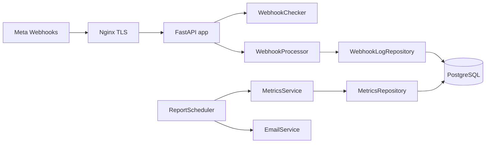
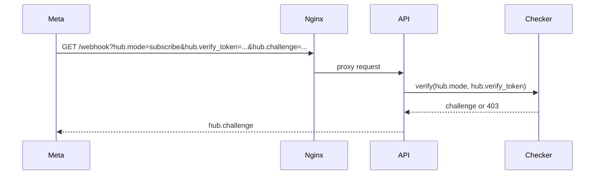
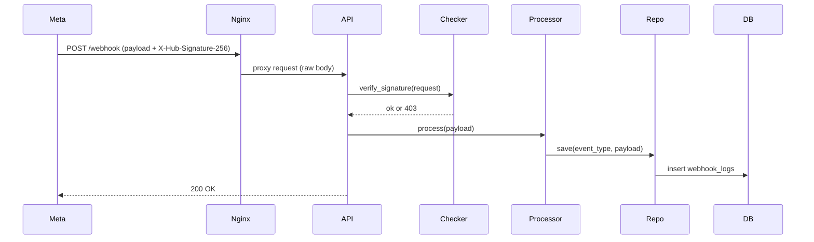

# Instagram Webhook Service (FastAPI)

Production-ready webhook receiver for Instagram/Meta events using FastAPI, async SQLAlchemy, PostgreSQL, and Nginx.

## Table of Contents

- Overview
- Features
- Architecture
- Request Flows
- Signature Verification
- Data Model
- Project Structure
- Configuration
- Run Locally
- Run with Docker
- Endpoints
- Testing
- Documentation

## Overview

This service exposes two public endpoints: a GET verification endpoint used by Meta during webhook setup, and a POST endpoint that receives event payloads. The POST flow validates the HMAC signature (if enabled), validates payload structure, persists a raw log entry, and schedules background processing for event-specific actions. A scheduler can generate and email daily and weekly metrics reports.

## Features

- GET /webhook verification handshake
- POST /webhook payload reception and signature validation
- Async persistence of raw webhook logs in PostgreSQL
- Background processing per event type
- Scheduled daily and weekly metrics reports
- Health endpoint for monitoring
- Nginx reverse proxy with HTTPS and raw body forwarding

## Architecture



Layer responsibilities:

- Routes: HTTP endpoints, input validation, dependency wiring
- Controllers: signature validation, payload validation, and event dispatching
- Repositories: persistence and reporting queries
- Services: metrics report generation and email delivery
- Scheduler: periodic jobs
- Infrastructure: FastAPI app lifecycle, async database connection, Nginx TLS

## Request Flows

### GET /webhook (Meta verification)



### POST /webhook (Event ingestion)



## Signature Verification

Header format:

```
X-Hub-Signature-256: sha256=<hex>
```

Validation steps:

1. Read raw request body bytes.
2. Compute HMAC SHA256 using INSTAGRAM_APP_SECRET.
3. Compare with header signature using constant-time comparison.

Important: Nginx must pass the raw body without buffering; see nginx/conf.d/webhook.conf.

## Data Model

Table DataLake.webhook_logs:

| Column        | Type        | Notes                         |
| ------------- | ----------- | ----------------------------- |
| id            | integer PK  | Auto increment                |
| event_type    | varchar(50) | comments, messages, mentions  |
| payload       | JSONB       | Raw Meta payload              |
| received_at   | timestamptz | server_default now()          |
| received_date | date        | server_default current_date() |
| received_time | time        | server_default current_time() |

SQL creation scripts live in app/db/queries.

## Project Structure

```
app/
  main.py                    # FastAPI app and lifespan hooks
  routes/                    # HTTP endpoints
  controllers/               # Request validation and processing
  models/                    # SQLAlchemy ORM models
  repositories/              # Database access and queries
  services/                  # Metrics and email services
  scheduler/                 # APScheduler jobs
  config/                    # Settings, DB config, payload models
  db/queries/                # SQL scripts for tables
nginx/conf.d/                # Nginx virtual host
test/                        # Pytest suite
docker-compose.yml
dockerfile
requirements.txt
Example.env
```

## Configuration

Use Example.env as a template and create a .env file with the following keys:

```
# App
SECRET_KEY=change_me
DEBUG=false
HOST=0.0.0.0
PORT=8000

# Database
POSTGRES_USER=your_user
POSTGRES_PASSWORD=your_password
POSTGRES_HOST=your_db_host
POSTGRES_PORT=5432
POSTGRES_DB=your_db
DB_ECHO=false

# Instagram/Meta
INSTAGRAM_VERIFY_TOKEN=your_verify_token
INSTAGRAM_APP_SECRET=your_app_secret
VERIFY_SIGNATURE=true
INSTAGRAM_ACCESS_TOKEN=your_access_token
INSTAGRAM_BUSINESS_ACCOUNT_ID=your_business_account_id

# Email
EMAIL_SENDER=sender@example.com
EMAIL_PASSWORD=app_password_or_token
RECIPIENT_EMAIL=recipient1@example.com,recipient2@example.com
```

Security note: keep .env out of version control and keep VERIFY_SIGNATURE enabled in production.

## Run Locally

```
python -m venv venv
venv\Scripts\activate
pip install -r requirements.txt
uvicorn app.main:app --host 0.0.0.0 --port 8000 --reload
```

Alternative with FastAPI CLI:

```
fastapi dev app/main.py
```

## Run with Docker

```
docker compose up --build
```

Notes:

- The compose file does not include a PostgreSQL container. Configure POSTGRES_HOST to point to your DB.
- Update nginx/conf.d/webhook.conf with your domain and TLS certificate paths.

## Endpoints

- GET /health
  - Returns a simple JSON status.
- GET /webhook
  - Meta verification endpoint. Expects query params hub.mode, hub.verify_token, hub.challenge.
  - Returns the hub.challenge string when validation passes.
- POST /webhook
  - Receives Instagram webhook payloads.
  - Validates X-Hub-Signature-256 when VERIFY_SIGNATURE is true.
  - Persists raw payload and starts background processing.

## Testing

```
pytest
```

## Documentation

- docs/technical_documentation.md
- docs/architecture_report.md
- docs/security_report.md
- docs/refactoring_suggestions.md
- docs/structure_improvements.md
